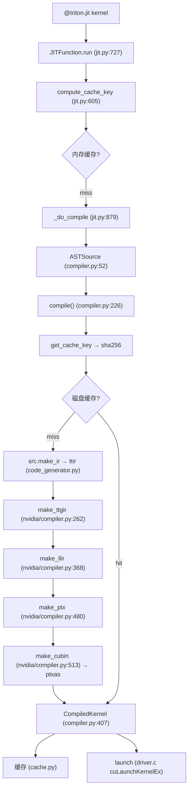

# 07 从 Python DSL 到 GPU Kernel（深度版）

> 本文目标是整套文档的心脏。深入每个阶段的内部机制——JIT 触发、AST→ttir、pass 流水线、LLVM→PTX→cubin。

## 1. 端到端链路



## 2. 阶段 1：JIT 触发（深度）

`JITFunction.run`（`jit.py:727`）：
```python
device = driver.active.get_current_device()
stream = driver.active.get_current_stream(device)
kernel_cache, kernel_key_cache, target, backend, binder = self.device_caches[device]
bound_args, specialization, options = binder(*args, **kwargs)
key = compute_cache_key(kernel_key_cache, specialization, options)
kernel = kernel_cache.get(key, None)
if kernel is None:
    kernel = self._do_compile(key, signature, device, constexprs, options, attrs, warmup)
...
kernel.run(grid_0, grid_1, grid_2, stream, kernel.function, ...)
```
- `device_caches`：每 device 一个缓存。
- `binder`：`create_function_from_signature`（:396）用 exec 生成，内联 specialization。
- `compute_cache_key`（:605）：`(tuple(specialization), str(options))`。

## 3. 阶段 2：compile() 与缓存（深度）

`compile()`（`compiler.py:226`）：
```python
backend = make_backend(target)
options = backend.parse_options(dict(options or dict(), **extra_options))
env_vars = get_cache_invalidating_env_vars()
key = get_cache_key(src, backend, options, env_vars=env_vars)
hash = hashlib.sha256(key.encode()).hexdigest()
fn_cache_manager = get_cache_manager(hash)
metadata_group = fn_cache_manager.get_group(metadata_filename) or {}
metadata_path = metadata_group.get(metadata_filename)
if not always_compile and metadata_path is not None:
    return CompiledKernel(src, metadata_group, hash)   # 磁盘缓存命中
```

**get_cache_key 完整组成（`cache.py:319`）**：
```python
key = f"{triton_key()}-{src.hash()}-{backend.hash()}-{backend_options.hash()}-{str(sorted(env_vars.items()))}"
```
1. `triton_key()`：`__version__` + 编译器源码（jit.py/compiler/backends）+ `libtriton` 二进制 hash。
2. `src.hash()`：ASTSource 时 = fn.cache_key（AST sha256）+ signature + constexprs。
3. `backend.hash()`：ptxas 版本 + arch（nvidia compiler.py:611）。
4. `options.hash()`：所有 options 字段 + extern_libs 的 file_hash。
5. `env_vars`：约 30 个 CACHE_INVALIDATING 环境变量。

## 4. 阶段 3：AST→ttir（深度）

`ast_to_ttir`（`code_generator.py:1712`）：
```python
generator = CodeGenerator(...)
generator.visit(fn.parse())   # ast.parse + ast.NodeVisitor 遍历
module.verify()               # MLIR 校验
```
- `visit_FunctionDef`（:638）：`self.builder.get_or_insert_function`（`python/src/ir.cc:1130`）创建 `tt.func`。
- `visit_For`（:1257）：`_find_carries` 做 dry run 探测循环携带变量，`create_for_op`（ir.cc:1191）生成 `scf.for`，`set_attr("tt.num_stages", ...)`（:1343）。
- `visit_If`（:1026）：tensor 条件 → scf.if；constexpr → 编译期折叠。

## 5. 阶段 4：pass 流水线（深度）

`make_ttgir`（`nvidia/compiler.py:262-340`）核心：
```python
pm = ir.pass_manager(mod.context)
passes.ttir.add_convert_to_ttgpuir(pm, f"cuda:{capability}", opt.num_warps, 32, opt.num_ctas)
passes.ttgpuir.add_coalesce(pm)
passes.ttgpuir.add_f32_dot_tc(pm, emuTF32)
nvidia.passes.ttnvgpuir.add_plan_cta(pm)
passes.ttgpuir.add_remove_layout_conversions(pm)
passes.ttgpuir.add_optimize_thread_locality(pm)
passes.ttgpuir.add_accelerate_matmul(pm)
passes.ttgpuir.add_remove_layout_conversions(pm)
passes.ttgpuir.add_optimize_dot_operands(pm, capability >= 80)
passes.ttir.add_loop_aware_cse(pm)
# SM89/90 分支：
passes.ttgpuir.add_fuse_nested_loops(pm)
nvidia.passes.hopper.add_hopper_warpspec(pm, opt.num_stages, dump_enabled)
passes.ttgpuir.add_assign_latencies(pm, opt.num_stages)
passes.ttgpuir.add_schedule_loops(pm)
passes.ttgpuir.add_pipeline(pm, opt.num_stages, dump_enabled)
```

**关键 pass 链**（详见 `08`）：
1. `convert_to_ttgpuir`：ttir→ttgir（布局推断）。
2. `coalesce`：访存合并。
3. `accelerate_matmul`：mma 布局。
4. `remove_layout_conversions`：布局消除。
5. `pipeline`：软件流水线。

## 6. 阶段 5：llir（深度）

`make_llir`（`nvidia/compiler.py:368`）：
```python
allocate_shared_memory_nv(...)
allocate_tensor_memory(...)      # tmem
add_to_llvmir(...)               # TTGIR→LLVM dialect
add_nvvm_to_llvm(...)
llvm.init_targets()
llvm.to_module(mod, context)     # MLIR→LLVM Module
# triple: nvptx64-nvidia-cuda, proc: sm_<cap>
llvm.optimize_module(..., OPTIMIZE_O3, disable_slp_vectorizer=capability==80)
```

## 7. 阶段 6-7：ptx → cubin（深度）

`make_ptx`（:480）：`llvm.translate_to_asm` 生成 PTX，正则抓 `.visible .entry` 内核名。
`make_cubin`（:513）：
```python
ptxas_cmd = [...]   # 含 -lineinfo, -g, --fmad=false, --regAllocOptLevel=2, --gpu-name=sm_<cap>
# subprocess 调 ptxas
# 失败解析 returncode (255=内部错误等) → PTXASError
```

## 8. 阶段 8：launch（深度）

`driver.c` 的 `_launch`（:982）：
```c
config.gridDimX = gridX * num_ctas;
config.blockDimX = 32 * num_warps;
cuLaunchKernelEx(&config, function, params, 0);
```
- 支持超大共享内存、PDL、协作网格、cluster 等 launch attribute。

## 9. 完整示例：vector add 逐阶段

| 阶段 | 输入 | 输出 | 位置 |
| --- | --- | --- | --- |
| JIT | `add[(1,)](x, y, n, BLOCK=1024)` | key | jit.py:727 |
| AST | fn | ttir module | code_generator.py:1712 |
| compile | ttir | ttgir/llir/ptx/cubin | compiler.py:226 |
| pass | module | 优化后 module | nvidia/compiler.py:262 |
| PTXAS | ptx | cubin | nvidia/compiler.py:513 |
| launch | cubin | GPU 执行 | driver.c:982 |

## 10. 深入自测

1. `get_cache_key` 的五元组？
2. `triton_key()` 为什么含 libtriton 二进制 hash？
3. `visit_For` 如何探测循环携带变量？
4. make_ttgir 的 6+ 个核心 pass？
5. make_cubin 如何调 ptxas？
6. driver.c 的 launch 用了哪些 attribute？

## 11. 下一步

进入 `08_IR与编译Pass.md`（深度版）。
