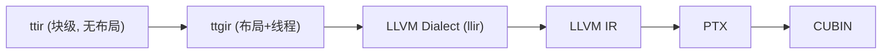

# 08 IR 与编译 Pass（深度版）

> 本文目标：深入 ttir/ttgir/llir 的 IR 层级，以及 make_ttgir 的完整 pass 链算法。

## 1. IR 层级



## 2. ttir（无布局块级 IR）

- `lib/Dialect/Triton/` 定义。
- `tt.load/tt.store/tt.dot/tt.range` 等。
- **关键澄清**：TTGIR 中 dot 仍是 `tt.dot`（`TritonOps.td:681`），不是独立 ttg.dot——只是操作数带 ttg 布局编码。

## 3. ttgir（布局+线程）

- `lib/Dialect/TritonGPU/` 定义。
- **布局属性**：`#ttg.blocked`/`#ttg.mma`/`#ttg.dot_op`/`#ttg.swizzled_shared`。
- `ttg.local_load/local_store`（shared 访存）、`ttg.convert_layout` 等。

## 4. make_ttgir pass 链（深度）

`nvidia/compiler.py:262-340`，按架构分支。

### 通用链
| pass | 作用 | 实现 |
| --- | --- | --- |
| `convert_to_ttgpuir` | ttir→ttgir（布局推断） | `lib/Conversion/TritonToTritonGPU` |
| `coalesce` | 访存合并 | `Coalesce.cpp` |
| `f32_dot_tc` | TF32 dot | `F32DotTC.cpp` |
| `plan_cta` | CTA 规划 | `nvidia/lib/` |
| `remove_layout_conversions` | 布局消除 | `RemoveLayoutConversions.cpp` |
| `optimize_thread_locality` | 线程局部性 | |
| `accelerate_matmul` | mma 布局 | `AccelerateMatmul.cpp` |
| `optimize_dot_operands` | dot 操作数 | `OptimizeDotOperands.cpp` |
| `loop_aware_cse` | 循环感知 CSE | |

### SM89/90（[8,9]）分支
```
fuse_nested_loops → canonicalizer → triton_licm
→ combine_tensor_select_and_if
→ hopper_warpspec
→ assign_latencies(num_stages)
→ schedule_loops(num_stages)
→ pipeline(num_stages)
```

### SM100+ 分支
```
→ warp_specialize(num_stages)
→ pipeline(num_stages)
→ optimize_partition_warps
→ hoist_tmem_alloc
→ remove_tmem_tokens
```

## 5. 核心 pass 深度

### Coalesce（`Coalesce.cpp:77-120`）
用 AxisInfo 的 contiguity 决定布局：
```cpp
auto contiguity = axisInfoAnalysis.getAxisInfo(ptr)->getContiguity();
SmallVector<unsigned> order = getOrderFromContiguity(contiguity);
unsigned perThread = getNumElementsPerThread(op, order, ...);
sizePerThread[order[0]] = perThread;
return BlockedEncodingAttr::get(...);
```

### AccelerateMatmul（`AccelerateMatmul.cpp`）
`getMMAVersionSafe`（:43-84）按 arch 选版本：
```
CC<75 → {1} (Volta)
CC<90 → {2} (Turing/Ampere)
CC<100 → {3,2} (Hopper wgmma 优先)
CC<120 → {5,2} (Blackwell tcgen05 优先)
CC<130 → {2}
```
`BlockedToMMA`（:490）：v3 → `WarpGroupDotOp`；v1/2 → `tt.dot` + `#ttg.dot_op` 操作数。

### RemoveLayoutConversions
- anchor（load/store/dot）布局不动。
- 前向传播，把 convert_layout 推到可任意布局的 op（load/splat）。
- `areLayoutsEquivalent`（Dialect.cpp:4388）：两布局转 LL 后比相等。

### Pipeline（Pipeliner）
见 `16` 或 `07` 详述。

## 6. 如何打印 IR

```bash
TRITON_DUMP_IR=1 TRITON_DUMP_DIR=/tmp/dump python my_kernel.py
# 或
bin/triton-opt /tmp/x.ttgir --pass-name
```

## 7. 深入自测

1. IR 五层？
2. tt.dot 在 TTGIR 里是什么？
3. getMMAVersionSafe 如何选版本？
4. Coalesce 如何用 AxisInfo？
5. SM89 vs SM100 的 pass 分支差异？

## 8. 下一步

进入 `09_语言与DSL设计.md`（深度版）。
