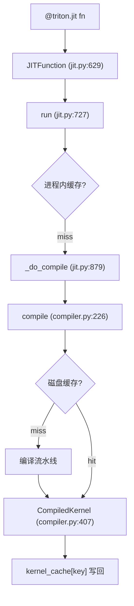

# 10 运行时与 JIT 机制（深度版）

> 本文目标：深入 JIT 的缓存键计算、磁盘缓存、CompiledKernel、launcher。

## 1. JIT 架构



## 2. 进程内缓存（深度）

`JITFunction.run`（:727）：
```python
kernel_cache, kernel_key_cache, target, backend, binder = self.device_caches[device]
key = compute_cache_key(kernel_key_cache, specialization, options)
kernel = kernel_cache.get(key, None)
```
- `kernel_cache`：`{cache_key: CompiledKernel}` dict。
- `compute_cache_key`（:605）：
  ```python
  key = (tuple(specialization), str(options))
  cache_key = kernel_key_cache.get(key, None)
  if cache_key is not None: return cache_key
  cache_key = str(_replace_jit_callables(specialization)) + str(options)
  kernel_key_cache[key] = cache_key
  ```

## 3. 磁盘缓存 key（深度，`cache.py:319`）

```python
def get_cache_key(src, backend, backend_options, env_vars):
    key = f"{triton_key()}-{src.hash()}-{backend.hash()}-{backend_options.hash()}-{str(sorted(env_vars.items()))}"
    return key
```

### triton_key()（:283-316，lru_cache）
`f'{__version__}' + sha256(...)`，覆盖：
- `jit.py` 源码。
- `triton/compiler/*`、`triton/backends/*` 全部 Python。
- **`libtriton` 二进制**（逐 1MB 分块 hash）。
- `triton/language/*`。

### src.hash()（ASTSource，compiler.py:71-76）
```python
key = f"{self.fn.cache_key}-{self.attrs}-{sorted_sig}-{constants_key}"
```
- `fn.cache_key`（jit.py:515-538）：AST 的 sha256 + 被调用 JIT 函数 + 全局变量 + 起始行号。

### backend.hash()（nvidia compiler.py:611）
`f'{get_ptxas_version(arch)}-{arch}'`。

### options.hash()（nvidia compiler.py:154）
所有 options 字段 + extern_libs 的 file_hash。

## 4. 磁盘缓存（深度，cache.py）

```python
self.cache_dir = knobs.cache.dir          # ~/.triton/cache
self.cache_dir = os.path.join(self.cache_dir, self.key)
```
- 目录：`~/.triton/cache/<base32(sha256)>/`。
- 文件：`<name>.ttir/.ttgir/.llir/.ptx/.cubin` + `<name>.json`（metadata）+ `__grp__<name>.json`（group 索引）。
- **原子写**：uuid 临时目录 + `os.replace`（POSIX 原子，cache.py:103-127）。
- **跨进程复用**：`get_group` 检查 child path 都在 → 命中。

## 5. CompiledKernel（深度）

`compiler.py:407`：
- 持有 src/metadata_group/hash。
- `_init_handles`（:448）：`loadBinary`（driver.c:280）→ cubin 加载 + CUfunction。
- `kernel.asm["ttir"/"ttgir"/"ptx"/"cubin"]`：查看各阶段。
- `__del__`（:445）：`unloadModule`。

## 6. launcher（深度）

- 由 `driver.c` 的 `launchKernel`（:1431）实现。
- `buildSignatureMetadata`（:1337）：参数类型 → extractor。
- `extractArgs`（:1374）：扁平化参数。
- `extraction_map`（:1243）：类型名 → extractor 函数（i1/i8/fp32/*ptr/nvTmaDesc）。
- `_launch`（:982）：`cuLaunchKernelEx`。

## 7. 常见问题（深度）

- 强制重编：`TRITON_ALWAYS_COMPILE=1`。
- 缓存目录：`TRITON_CACHE_DIR`。
- 查看产物：`kernel.asm[...]` 或读缓存目录。

## 8. 动手实验

```bash
mkdir -p /home/hpc/ghr_code/cuda_pytorch/triton/experiments/10_jit
python test_cache.py   # 观察缓存目录 + 结果校验
```

## 9. 深入自测

1. 磁盘缓存 key 的五元组？
2. `triton_key()` 为何含 libtriton 二进制 hash？
3. 原子写如何保证？
4. CompiledKernel 持有什么？
5. launcher 如何打包参数？

## 10. 下一步

进入 `11_自动调优机制.md`（深度版）。
