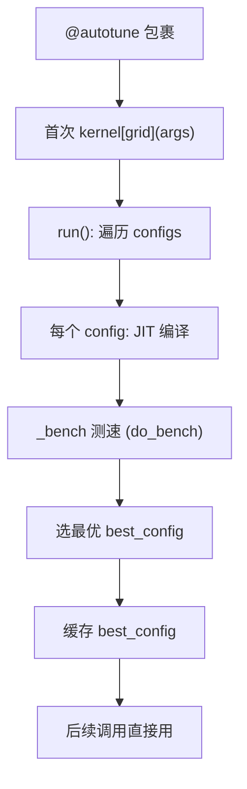

# 11 自动调优机制（深度版）

> 本文目标：深入 `@triton.autotune` 的实现（autotuner.py）、Config、benchmark、缓存。

## 1. 核心文件

| 文件 | 内容 |
| --- | --- |
| `python/triton/runtime/autotuner.py` | `autotune` 类（:21）、`Config`（:328）、`heuristics` |
| `python/triton/runtime/jit.py` | JITFunction |
| `python/triton/testing.py` | `do_bench` |

## 2. `autotune` 类（深度）

`autotuner.py:21`：
```python
class autotune:
    def __init__(self, fn, arg_names, configs, key, reset_to_zero, restore_value,
                 pre_hook=None, post_hook=None, prune_configs_by=None, ...):
```

### 关键方法
- `_bench`（:133）：测速单个 config。
- `run`（:217）：遍历 configs → 编译 → 测速 → 选最优。
- `best_config`：缓存最优。

## 3. `Config`（深度）

`autotuner.py:328`：
```python
class Config:
    def __init__(self, kwargs, num_warps=4, num_stages=3, num_ctas=1,
                 maxnreg=None, pre_hook=None, ir_override=None):
```
- `kwargs`：constexpr 参数（BLOCK 等）。
- `num_warps`：每 program warp 数。
- `num_stages`：流水线级数。
- `num_ctas`：Hopper+ cluster 规模。
- `maxnreg`：寄存器上限。
- `ir_override`：直接提供 IR。

## 4. 搜索流程（深度）



### benchmark（_bench :133）
- 用 `triton.testing.do_bench`（CUDA event 计时）。
- `key` 参数：只有 key 指定的运行时参数变化才重新 benchmark。

## 5. `heuristics` 与 `Config` 组合（深度）

```python
@triton.heuristics({"BLOCK": lambda n: triton.next_power_of_2(n)})
```
- 动态计算 constexpr 值。

## 6. 与 JIT 缓存的交互（深度）

- 每个 config 编译出的 kernel 走普通 JIT 缓存。
- autotune 的 `best_config` 是 Python 侧状态（不持久化）。
- `TRITON_CACHE_AUTOTUNING`：是否缓存 autotune 结果。

## 7. `do_bench`（testing.py）

```python
from triton.testing import do_bench
ms = do_bench(lambda: kernel[grid](...), warmup=25, rep=100)
```
- CUDA event 计时。
- 返回毫秒。

## 8. 动手实验

```bash
mkdir -p /home/hpc/ghr_code/cuda_pytorch/triton/experiments/11_autotune
python tune_gemm.py   # autotune GEMM，打印 best_config
```

## 9. 深入自测

1. Config 的 6 个字段？
2. autotune 如何触发编译与测速？
3. `key` 参数的作用？
4. best_config 是否持久化？
5. num_ctas 是什么？

## 10. 下一步

进入 `12_编译与安装指南.md`（深度版）。
