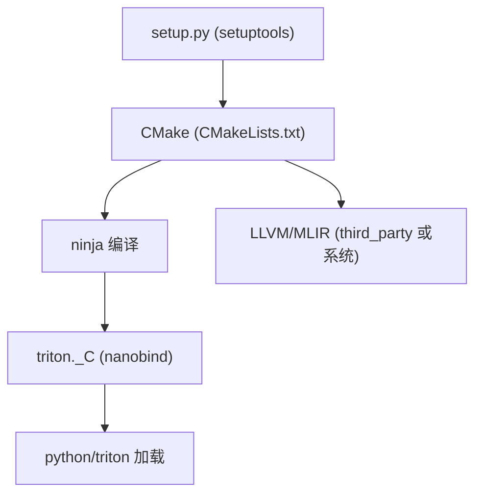

# 12 编译与安装指南（深度版）

> 本文目标：深入 Triton 的源码构建（setup.py + CMake + ninja + nanobind + LLVM），给出本机可执行步骤。

## 1. 安装方式

| 方式 | 命令 | 场景 |
| --- | --- | --- |
| 官方 wheel | `pip install triton` | 快速开始 |
| 源码 editable | `pip install -e .` | 开发/读源码 |
| 开发模式 | `make dev-install` | 改 C++ |

## 2. 构建系统概览（深度）



- `pyproject.toml`：`build-backend = "setuptools.build_meta"`，requires 含 cmake/ninja/nanobind。
- `nanobind`：绑定 C++（`triton._C`）。
- LLVM：构建时拉取（commit 锁定）。

## 3. 本机步骤（RTX 4090, CUDA 12.8, Python 3.12）

```bash
# 1) conda 环境
conda create -n triton python=3.12 -y
conda activate triton

# 2) 系统依赖
cmake --version
ninja --version || pip install ninja
export CUDA_HOME=/usr/local/cuda-12.8
export PATH=/usr/local/cuda-12.8/bin:$PATH
export LD_LIBRARY_PATH=/usr/local/cuda-12.8/lib64:$LD_LIBRARY_PATH

# 3) 源码编译（4 核）
cd /home/hpc/ghr_code/triton
CMAKE_BUILD_PARALLEL_LEVEL=4 pip install -e .
```

## 4. C++ 在哪一步编译（深度）

1. `pip install -e .` → setup.py → CMake configure。
2. CMake 编译 `lib/` + `include/` + `third_party/`（含 LLVM）。
3. 生成 `triton._C*.so`（nanobind）+ `bin/triton-opt` 等。
4. `make`（`ninja -C $BUILD_DIR`）做增量构建。

**注意**：
- 只改 `python/triton/*.py` → 不用 `make`。
- 改 C++ → `make` 或重跑 `pip install -e .`。

## 5. 验证

```bash
python -c "import triton; print(triton.__version__)"   # 3.8.0

# 最小 kernel
python -c "
import torch, triton, triton.language as tl
@triton.jit
def add(x, y, n, BLOCK: tl.constexpr):
    offs = tl.program_id(0)*BLOCK + tl.arange(0, BLOCK)
    tl.store(y + offs, tl.load(x + offs) + 1, mask=offs < n)
x = torch.randn(1024, device='cuda'); y = torch.empty_like(x)
add[(1,)](x, y, 1024, BLOCK=1024)
torch.cuda.synchronize()
print('ok:', torch.allclose(y, x + 1))
"
```

## 6. 常见问题

| 问题 | 解决 |
| --- | --- |
| LLVM 编译太慢 | `TRITON_OFFLINE_BUILD` 或预编译 LLVM |
| nanobind 加载失败 | 统一 Python/CUDA 环境后重装 |
| `triton._C` 找不到 | 确认装了 triton 本体 |
| 内存不足 | `CMAKE_BUILD_PARALLEL_LEVEL=2` |

## 7. 深入自测

1. 构建链路？
2. 只改 Python 需要重编吗？
3. LLVM 如何进入构建？
4. nanobind 生成什么？
5. 如何增量重编 C++？

## 8. 下一步

进入 `13_编译系统解析.md`（深度版）。
