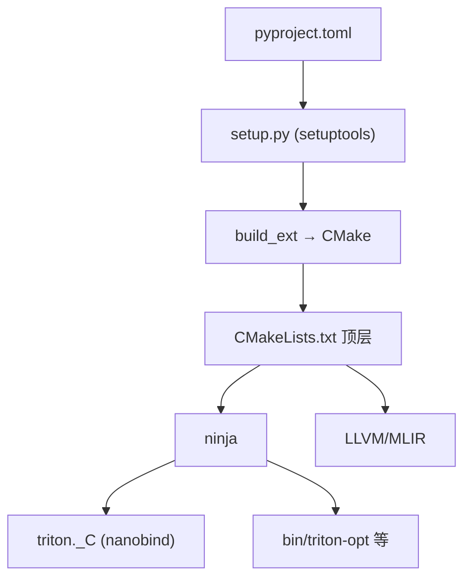

# 13 编译系统解析（深度版）

> 本文目标：深入 setup.py + CMake + Makefile 的细节，理解 `triton._C` 的生成与 LLVM 集成。

## 1. 构建系统总览



## 2. CMakeLists.txt（深度）

顶层 `CMakeLists.txt` 关键选项：
```
cmake_minimum_required(VERSION 3.20)
project(triton CXX C)
option(TRITON_BUILD_PYTHON_MODULE "Build Python Triton bindings" OFF)
option(TRITON_BUILD_PROTON "Build the Triton Proton profiler" ON)
option(TRITON_STABLE_ABI "Build with Python Stable ABI (abi3)" OFF)
option(TRITON_BUILD_UT "Build C++ Triton Unit Tests" ON)
option(TRITON_BUILD_WITH_CCACHE "Build with ccache" ON)
option(TRITON_OFFLINE_BUILD "Build without downloading dependencies" OFF)
set(TRITON_CODEGEN_BACKENDS "" CACHE STRING)
set(TRITON_VERSION "" CACHE STRING)   # 从 setup.py 传入
set(TRITON_CACHE_PATH "" CACHE PATH)
```
- `CMAKE_CXX_STANDARD 17`。

## 3. setup.py（深度）

- 定义 `Extension`（`triton._C`）。
- `build_ext`：调 CMake configure + ninja。
- 传入 `TRITON_VERSION`。
- 用 nanobind 而非 pybind11。

## 4. Makefile 辅助（深度）

`Makefile` 是开发辅助，不是构建系统本体：
```makefile
PYTHON ?= python3
BUILD_DIR := $(shell PYTHONPATH="./python" python3 -c 'from build_helpers import get_cmake_dir; print(get_cmake_dir())')

all:          # ninja -C $(BUILD_DIR)
triton-opt:   # ninja -C $(BUILD_DIR) triton-opt
test-lit:     # ninja -C $(BUILD_DIR) check-triton-lit-tests
test-cpp:     # ninja -C $(BUILD_DIR) check-triton-unit-tests
test-unit:    # pytest python/test/unit
dev-install-requires:  # pip install -r requirements.txt
```
- `get_cmake_dir()` 在 `python/build_helpers.py`。

## 5. LLVM 集成（深度）

- 构建时 `find_package(MLIR)` 或在 `third_party/` 找。
- `TRITON_OFFLINE_BUILD` 控制下载。
- LLVM 提供 NVPTX 后端（`llvm.translate_to_asm` 生成 PTX）。

## 6. nanobind 绑定（深度）

- `python/src/*.cc` 用 nanobind 定义 Python 模块（`ir`/`passes`/`llvm`/`linear_layout` 等）。
- `python/src/main.cc:60-72` 组装子模块。
- `third_party/nvidia/triton_nvidia.cc` 加载 NVIDIA 后端。

## 7. 深入自测

1. 构建链路？
2. 5 个 TRITON_* CMake 选项？
3. Makefile 与构建系统的关系？
4. LLVM 如何集成？
5. nanobind 生成什么？

## 8. 下一步

进入 `14_示例代码研读.md`（深度版）。
