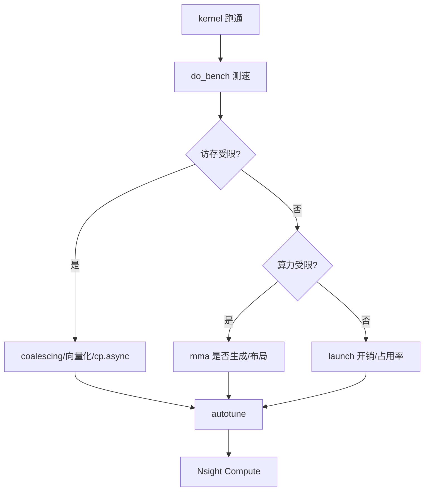

# 17 性能分析指南（深度版）

> 本文目标：从列优化手段升级为性能决策树，深入 num_warps/num_stages 对 IR 的影响，以及从 ttgir 判断生成质量。

## 1. 调优决策树



## 2. 瓶颈判断（Roofline）

RTX 4090：fp16 ~330 TFLOPS，HBM ~1 TB/s。
`算术强度 = flops/bytes`，对比 roofline 斜线。

## 3. num_warps/num_stages 对 IR 的影响（深度）

- **num_warps**：决定 CTA 线程数（warps×32），影响布局分配（`threadsPerWarp`/`warpsPerCTA`）。
- **num_stages**：>1 才流水线（`AssignLatencies.cpp:313`），stage 数 = `(numStages-1)/(maxIndirectionLevel+1)`，buffer 份数 = stage 差。

## 4. 从 ttgir 判断生成质量（深度）

```bash
TRITON_DUMP_IR=1 TRITON_DUMP_DIR=/tmp/dump python my_kernel.py
```
看：
1. **`#ttg.mma`** → tensor core 生效。
2. **`ttg.async_copy_global_to_local`** → cp.async 生效。
3. **`ttg.dot_op`** → dot 操作数布局正确。
4. **`convert_layout` 数量** → 布局转换开销。
5. **`local_alloc` 的缓冲份数** → 流水线深度。

## 5. 关键优化手段

| 手段 | 机制 |
| --- | --- |
| autotune | 搜 num_warps/num_stages/BLOCK |
| num_stages 增大 | 更深的流水线（更多缓冲） |
| 避免 mask | 整除 shape 减少分支 |
| 连续访问 | AxisInfo contiguity 高 → 向量化 |

## 6. Nsight 分析

```bash
nsys profile -o /tmp/prof python my_kernel.py
ncu --kernel-name regex python my_kernel.py
```
关键指标：Memory/Compute Throughput、Achieved Occupancy、stall。

## 7. 常见陷阱

1. 小 load 不进 shared（退寄存器流水）。
2. mask 过多。
3. 布局转换开销大。
4. 寄存器溢出。

## 8. 动手实验

```bash
mkdir -p /home/hpc/ghr_code/cuda_pytorch/triton/experiments/17_perf
python bench_gemm.py   # 测速对比 cuBLAS
```

## 9. 深入自测

1. num_stages 如何影响 IR？
2. 判断生成质量的 5 个信号？
3. Roofline 判断方法？
4. 常见陷阱 4 个？

## 10. 下一步

进入 `18_Triton与TileLang对比.md`（深度版）。
