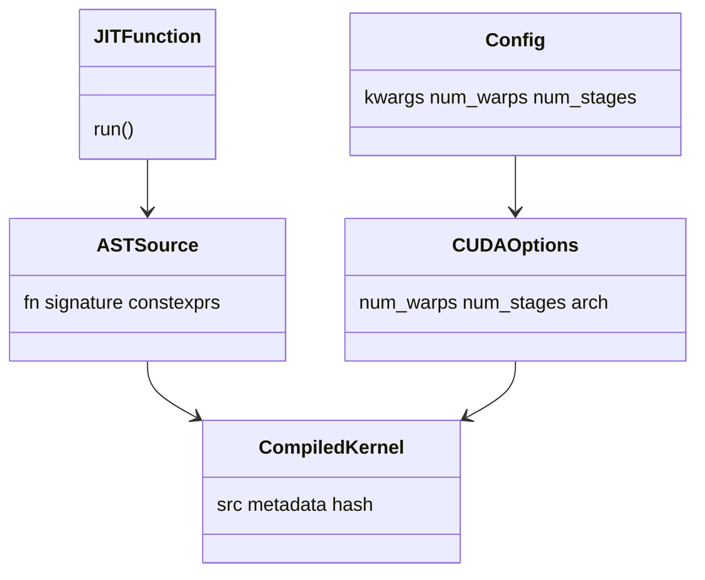

# 20 核心数据结构（深度版）

> 本文目标：深入 LinearLayout、EncodingAttr、ASTSource/CompiledKernel、Config 的完整定义。

## 1. LinearLayout（核心数学）

`include/triton/Tools/LinearLayout.h`：
```cpp
class LinearLayout {
private:
  llvm::MapVector<StringAttr, vector<vector<int32_t>>> bases;  // 每输入维每位的基向量
  llvm::MapVector<StringAttr, int32_t> outDims;
  int32_t rank = 0;   // 矩阵秩
};
```

**数学本质**：GF(2) 线性映射。`L(a) = Σ a_i·B_i`（xor 基向量）。

### 核心 API
| API | 作用 | 位置 |
| --- | --- | --- |
| `apply` | 硬件坐标 → 张量下标 | `LinearLayout.cpp:885` |
| `operator*` | 直和（矩阵块对角） | `:704` |
| `invertAndCompose` | `B⁻¹∘A`（布局转换） | `:1042` |
| `getMatrixRank` | 高斯消元算秩 | `:207` |
| `isSurjective` | rank == 满射条件 | |

## 2. EncodingAttr（布局属性）

| 属性 | 字段 | 作用 |
| --- | --- | --- |
| `BlockedEncodingAttr` | sizePerThread/threadsPerWarp/warpsPerCTA/order | 通用布局 |
| `NvidiaMmaEncodingAttr` | versionMajor/warpsPerCTA/instrShape | mma 布局 |
| `DotOperandEncodingAttr` | opIdx/parent/kWidth | dot 操作数 |
| `SwizzledSharedEncodingAttr` | vec/perPhase/maxPhase | 共享内存 |
| `PaddedSharedEncodingAttr` | padding + 线性 | 共享内存 |

### 统一转换
`toLinearLayout(shape, encoding)`（`LinearLayoutConversions.cpp:1218-1314`）把任何 encoding 转成 LinearLayout。

## 3. Python 侧对象

| 对象 | 位置 | 作用 |
| --- | --- | --- |
| `JITFunction` | `runtime/jit.py:629` | `@triton.jit` |
| `ASTSource` | `compiler/compiler.py:52` | 编译输入 |
| `IRSource` | `compiler.py:89` | IR 文件输入 |
| `CompiledKernel` | `compiler.py:407` | 编译产物 |
| `Config` | `runtime/autotuner.py:328` | 编译配置 |
| `CUDAOptions` | `nvidia/backend/compiler.py:110` | CUDA 选项 |

## 4. ASTSource（深度）

`compiler.py:52`：
```python
class ASTSource:
    def __init__(self, fn, signature, constexprs=None, attrs=None):
```
- `fn`：用户函数。
- `signature`：参数类型字典（如 `{'x': '*fp32'}`）。
- `constexprs`：编译期常量。
- `make_ir`（:78）：`ast_to_ttir`。

## 5. CompiledKernel（深度）

`compiler.py:407`：
- 持有 src/metadata_group/hash。
- `_init_handles`（:448）：`loadBinary` → cubin + CUfunction。
- `asm` 属性查看各阶段。
- `launch_metadata` 供启动。

## 6. Config（深度）

`autotuner.py:328`：
```python
def __init__(self, kwargs, num_warps=4, num_stages=3, num_ctas=1, maxnreg=None, pre_hook=None, ir_override=None):
```

## 7. 对象关系



## 8. 深入自测

1. LinearLayout 的数学本质与核心 API？
2. 5 种 EncodingAttr 各管什么？
3. ASTSource 的三字段？
4. CompiledKernel 持有什么？
5. Config 的 6 字段？

## 9. 下一步

进入 `21_核心调用链.md`（深度版）。
