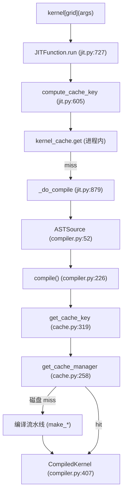
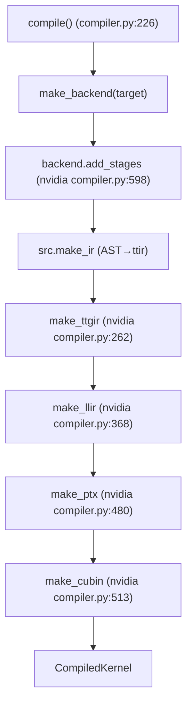
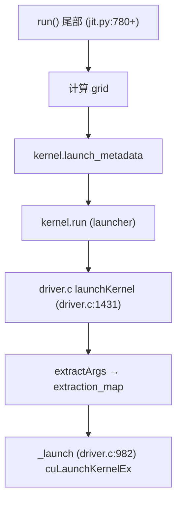
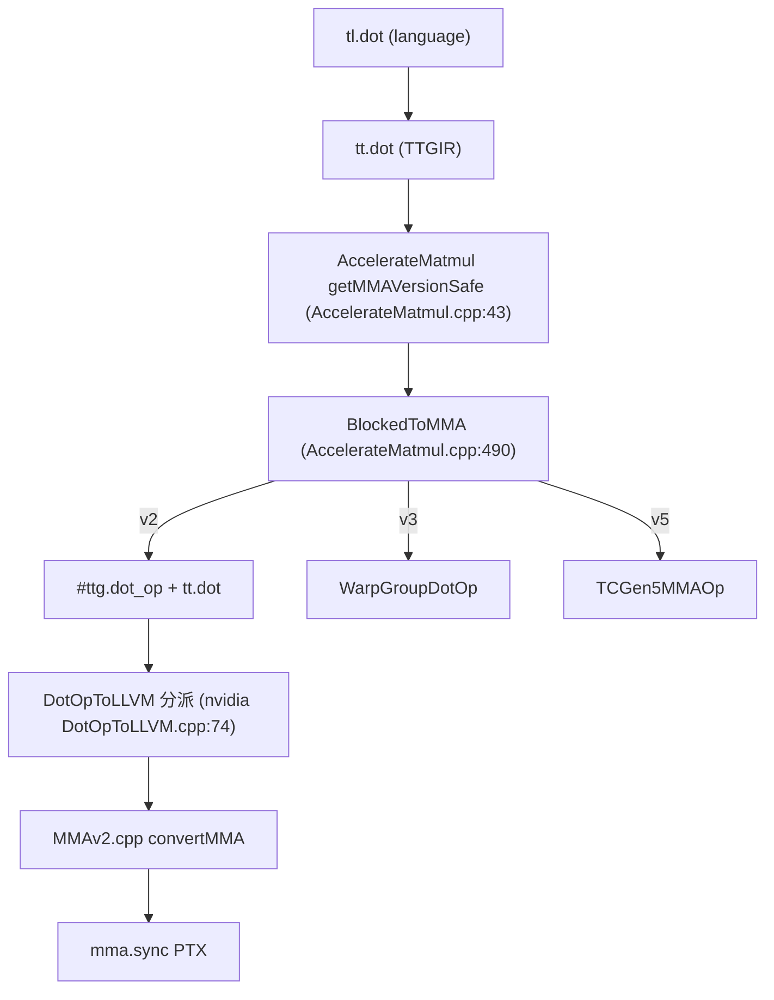

# 21 核心调用链（深度版）

> 本文目标：把 3 条调用链细化到函数/行号，作为源码导航精确索引。

## 1. 调用链 1：JIT 编译链

**关键位置**：
- run：jit.py:727
- _do_compile：jit.py:879
- compile：compiler.py:226
- ASTSource：compiler.py:52
- get_cache_key：cache.py:319
- CompiledKernel：compiler.py:407

## 2. 调用链 2：编译流水线链

`add_stages`（:598）注册：ttir/ttgir/llir/ptx/cubin 五阶段。

## 3. 调用链 3：launch 链

## 4. 调用链 4：tl.dot → mma 降级链（深度）

## 5. 后端发现链

## 6. 关键源码位置速查

| 想找 | 位置 |
| --- | --- |
| JIT 装饰器 | `jit.py:629` |
| run | `jit.py:727` |
| compile | `compiler.py:226` |
| AST→ttir | `code_generator.py:1712` |
| add_stages | `nvidia/compiler.py:598` |
| make_ttgir | `nvidia/compiler.py:262` |
| make_cubin | `nvidia/compiler.py:513` |
| get_cache_key | `cache.py:319` |
| getMMAVersionSafe | `AccelerateMatmul.cpp:43` |
| MMAv2 降级 | `nvidia/DotOpToLLVM/MMAv2.cpp` |
| CUDA driver | `driver.c:982` |

## 7. 深入自测

1. 4 条链各是什么？
2. `add_stages` 注册哪五阶段？
3. tl.dot 的降级分派逻辑？
4. get_cache_key 在哪？

## 8. 下一步

进入 `22_生成代码与中间产物.md`（深度版）。
