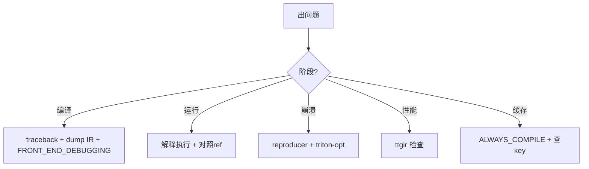

# 23 常见错误与排查（深度版）

> 本文目标：深入 6 类问题的根因链，每类给出"机制级"解释。

## 1. 错误分类

| # | 类别 | 抛出位置 |
| --- | --- | --- |
| 1 | 安装/加载 | `triton._C` 加载 |
| 2 | 编译期 | `CompilationError`/pass 报错 |
| 3 | 运行期 | CUDA error |
| 4 | 性能 | 生成代码质量 |
| 5 | 缓存 | key 未变 |
| 6 | 环境 | LLVM/CUDA/arch |

## 2. 编译期错误（深度）

**典型**：`CompilationError` / `mlir::` 内部错误。
- 根因：DSL 约束违反（`tl.arange` 非 2 的幂）、布局推断失败、pass 断言。
- 排查：
  1. 看 traceback 定位 pass。
  2. `TRITON_DUMP_IR=1` 看出错前 IR。
  3. `TRITON_FRONT_END_DEBUGGING=1` 透传原始异常（knobs.py:367）。
  4. `triton.compile("<file>.ttgir")` 从 IR 文件复现。

## 3. 运行期错误（深度）

**结果错误**：
- mask 缺失 → 越界 UB。
- `tl.dot` dtype 不符。
- 归约 axis 错。

排查：
- `TRITON_INTERPRET=1` 解释执行。
- 对照 torch 参考。

## 4. 崩溃处理（深度）

1. 保存 `mlir_reproducer` 到 `/tmp/x.mlir`。
2. `triton-opt /tmp/x.mlir --run-reproducer`。
3. `triton-reduce` 最小化。

## 5. 性能差（深度）

- 看 ttgir：无 `#ttg.mma`、无 `async_copy`。
- 布局转换过多。
- autotune 参数。

## 6. 缓存不生效（深度）

- key = triton_key + src.hash + backend.hash + options.hash + env_vars。
- 改源码 → `src.hash` 变（AST hash）。
- 改编译器 → `triton_key` 变（源码+libtriton hash）。
- 强制：`TRITON_ALWAYS_COMPILE=1`。
- 注意：`src.hash` 含起始行号——**同一函数移到不同行也会失效**。

## 7. 环境问题（深度）

- arch 不匹配：`TRITON_OVERRIDE_ARCH=sm89`。
- ptxas 版本：backend.hash 含 ptxas 版本。
- CUDA 版本：driver.c 的 dlsym 兼容。

## 8. 排查 SOP

## 9. 深入自测

1. 编译期错误排查顺序？
2. 崩溃如何复现？
3. `src.hash` 为什么含起始行号？
4. `TRITON_FRONT_END_DEBUGGING` 的作用？

## 10. 下一步

进入 `24_源码修改入门.md`（深度版）。
