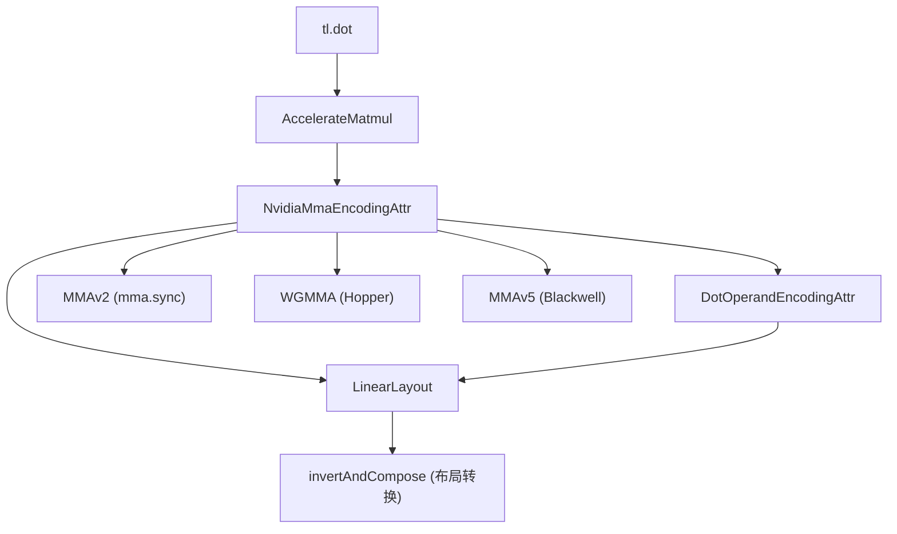

# 26 术语表（深度版）

> 本文目标：每个术语给"机制级解释 + 源码位置"，作为查漏工具。

## 1. 核心术语

| 术语 | 机制级解释 | 源码位置 |
| --- | --- | --- |
| **LinearLayout** | GF(2) 线性映射（矩阵），只存基向量 | `lib/Tools/LinearLayout.cpp` |
| **apply** | 硬件坐标→张量下标（xor 基向量） | `LinearLayout.cpp:885` |
| **invertAndCompose** | `B⁻¹∘A` 布局转换核心（伪逆） | `LinearLayout.cpp:1042` |
| **BlockedEncodingAttr** | sizePerThread/threadsPerWarp/warpsPerCTA/order | `TritonGPUAttrDefs.td:818` |
| **NvidiaMmaEncodingAttr** | versionMajor/warpsPerCTA/instrShape | `:1272` |
| **DotOperandEncodingAttr** | opIdx/parent/kWidth | `:1431` |
| **SwizzledSharedEncodingAttr** | 共享内存 swizzle | `:10` |
| **Coalesce** | 访存合并（AxisInfo 驱动） | `Coalesce.cpp:77` |
| **AccelerateMatmul** | mma 布局选择 | `AccelerateMatmul.cpp` |
| **RemoveLayoutConversions** | 布局转换消除 | `RemoveLayoutConversions.cpp` |
| **SoftwarePipeliner** | 软件流水线 | `Pipeliner/SoftwarePipeliner.cpp` |
| **LowerLoops** | load→cp.async + 多缓冲 | `Pipeliner/LowerLoops.cpp` |
| **getDefUseStageDiff** | buffer 份数 = stage 差 | `LowerLoops.cpp:76` |
| **getMMAVersionSafe** | 按 arch 选 mma 版本 | `AccelerateMatmul.cpp:43` |
| **supportMMA** | 按 dtype/shape 筛 mma | `lib/Analysis/Utility.cpp:1105` |
| **MMAv2** | mma.sync 降级 | `nvidia/DotOpToLLVM/MMAv2.cpp` |
| **WGMMA** | Hopper wgmma 降级 | `nvidia/DotOpToLLVM/WGMMA.cpp` |
| **MMAv5** | Blackwell tcgen05 | `nvidia/DotOpToLLVM/MMAv5.cpp` |
| **triton_key()** | 缓存键：版本+源码+libtriton | `cache.py:283` |
| **get_cache_key** | 5 元组缓存键 | `cache.py:319` |
| **driver.active** | 懒加载单例 | `runtime/driver.py:36` |
| **knobs.py** | TRITON_* 环境变量系统 | `python/triton/knobs.py` |
| **nanobind** | Python↔C++ 绑定 | `python/src/*.cc` |
| **triton-opt** | 单跑 MLIR pass | `bin/triton-opt.cpp` |
| **mlir_reproducer** | 崩溃复现 | `{-# ... #-}` metadata |

## 2. 概念关系图

## 3. 深入自测

1. LinearLayout 的本质与 3 个核心 API？
2. 4 种 EncodingAttr 字段？
3. getDefUseStageDiff 决定什么？
4. getMMAVersionSafe 如何选版本？
5. 缓存键的 5 元组？

## 4. 下一步

进入 `27_学习清单.md`。
