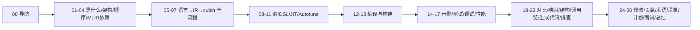

# 30 最终总结

## 1. 本文目标

- 对整套学习做复盘：学会了什么、掌握到什么程度、还有哪些未验证。
- 提供"一句话结论"供复习与对外输出。

## 2. 一句话总结

**Triton 是一个基于 MLIR 的块级 GPU 编程语言：用 Python 写 tile 算法，编译器自动做布局推断、访存合并、mma/wgmma 降级与软件流水线，生成接近手写 CUDA 性能的 kernel。**

## 3. 知识地图（30 篇）

## 4. 核心掌握项（已确认，源于源码）

1. 编译入口：`kernel[grid](args)` → `JITFunction.run`（`runtime/jit.py:727`）→ `_do_compile`（:879）。
2. 核心 `compile()`：`compiler/compiler.py:226`；`ASTSource`（:52）；`CompiledKernel`（:407）。
3. Pass 流水线：`third_party/nvidia/backend/compiler.py` 的 `add_stages`（:598）、`make_ttgir`（:262）、`make_llir`（:368）、`make_cubin`（:513）。
4. 缓存：`get_cache_key`（源码+target+options+env）→ `CacheManager`（`runtime/cache.py:14`）→ `~/.triton/cache/<hash>/`。
5. IR 层级：ttir（`lib/Dialect/Triton`）→ ttgir（`lib/Dialect/TritonGPU`）→ llir（`lib/Conversion/TritonGPUToLLVM`）→ LLVM IR（`lib/Target/LLVMIR`）→ ptx/cubin。
6. 布局系统：ttgir 的 `BlockedEncodingAttr`/`MmaEncodingAttr` 等；pass 在 `lib/Dialect/TritonGPU/Transforms/`。
7. 后端插件：`third_party/nvidia/backend/`（CUDAOptions、driver.c、libdevice）。
8. 构建：setup.py + CMake + ninja + nanobind（`triton._C`）。

## 5. 尚未验证（运行类结论）

> 需实际编译运行确认：
- [ ] 源码编译成功跑通最小 kernel。
- [ ] `TRITON_DUMP_IR` 产物的实际内容。
- [ ] 生成 PTX 中的具体指令（mma/cp.async）。
- [ ] 与 cuBLAS/TileLang 的实际性能对比。
- [ ] autotune 实际运行结果。

> 更新办法：见 `12`（编译）与 `17`（性能）动手实验；完成实验后回到本文勾选。

## 6. 收获

- 理解"块级编程 + MLIR 编译"如何把 tile 算法变成 GPU 指令。
- 掌握 JIT/缓存/pass/布局/autotune 的完整链路。
- 具备与 TileLang（TVM 栈）横向对比的能力。
- 具备扩展到 LLVM/MLIR 生态的能力。

## 7. 后续方向

1. 完成编译与实验验证（第 5 节清单）。
2. 深挖一个算子（GEMM/FlashAttention）的完整 lowering。
3. 参与上游贡献（`25`）。
4. 学习 MLIR/LLVM 生态与 TileLang 对比（`18`）。

## 8. 自测题（收官）

1. 30 篇文档分别讲什么？（对着 `00` 导航默写）
2. 一条指令从 Python 到 GPU 的全路径？
3. 你最有把握的 3 个知识点与最薄弱 3 个？
4. 用一句话说服面试官"我系统学过 Triton"？

## 9. 本文总结

学习完成 ≠ 掌握。**用编译和实验把"推断"变"确认"**，才算真正完成。

## 10. 掌握检查

- [ ] 完成 `27` 清单 ≥80%
- [ ] 完成 `12` 编译实验（或记录替代方案）
- [ ] 生成最终学习总结（本文 + 个人复盘）

## 11. 结束语

30 篇文档是地图，不是终点。祝你在 GPU 编译器之路上越走越顺。
